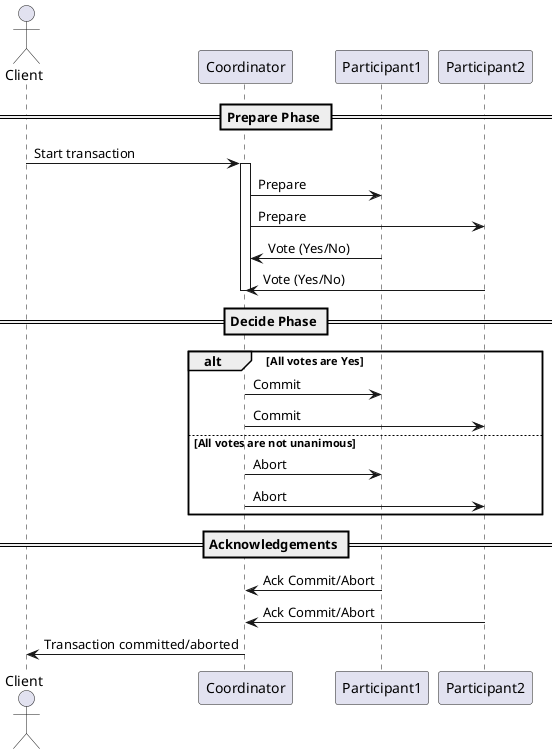
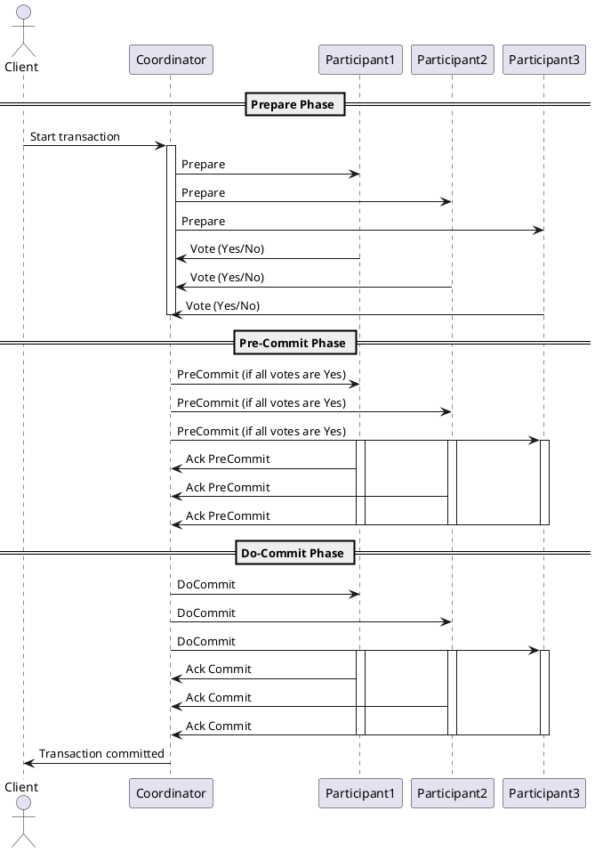

2PC（两阶段提交协议）和3PC（三阶段提交协议）是分布式系统中用于确保事务一致性的两种协议。它们主要用于分布式数据库和分布式事务处理系统中。

### 2PC（两阶段提交协议）

2PC是一种基本的分布式事务处理协议，它通过两个阶段来确保事务的一致性：

1. **投票阶段（Prepare Phase）**：

   - 事务协调者（Coordinator）向所有参与者（Participants）发送“准备”消息，询问它们是否准备好提交事务。
   - 参与者执行事务，但保留提交点，然后回复协调者它们是否准备好提交。
2. **提交阶段（Commit Phase）**：

   - 如果所有参与者都回复“准备就绪”，则协调者向所有参与者发送“提交”消息，指示它们提交事务。
   - 如果有任何参与者回复“不准备”，协调者将向所有参与者发送“回滚”消息，指示它们撤销事务。

2PC的优点是简单易懂，但它的主要缺点是它不是容错的。如果在提交阶段协调者发生故障，而参与者已经准备好提交事务，那么系统可能会处于不一致的状态。

### 3PC（三阶段提交协议）

3PC是2PC的一个改进版本，它通过引入一个额外的阶段来解决2PC中的一些问题：

1. **询问阶段（CanCommit Phase）**：

   - 协调者向所有参与者发送“是否可以提交”的询问消息。
2. **准备阶段（PreCommit Phase）**：

   - 参与者如果认为自己可以提交事务，就向协调者发送“准备提交”的响应，并进入预备提交状态。
   - 协调者等待所有参与者的响应，如果收到所有参与者的“准备提交”响应，就进入提交阶段。
3. **提交阶段（DoCommit Phase）**：

   - 协调者向所有参与者发送“提交”消息，指示它们提交事务。
   - 如果参与者收到“提交”消息，它们将提交事务并释放所有锁定的资源。
   - 如果协调者在预提交阶段没有收到所有参与者的响应，或者收到“不准备提交”的响应，它将向所有参与者发送“回滚”消息。

3PC通过引入询问阶段来减少协调者故障时的不确定性，使得系统在协调者故障后可以更安全地恢复。然而，3PC比2PC更加复杂，并且可能需要更多的通信开销。

### 2PC（两阶段提交）特点：

* **简单性**：2PC相对容易理解和实现。
* **阻塞性**：在准备阶段，如果协调者失败，参与者将无法决定是提交还是中止事务，导致阻塞。
* **网络开销**：相对较低，因为只有两个消息交换阶段。
* **适用场景**：适用于网络条件较好、协调者稳定可靠、参与者数量较少的场景。

### 3PC（三阶段提交）特点：

* **避免阻塞**：3PC通过引入超时机制和预提交阶段，减少了协调者失败导致的阻塞问题。
* **更高的容错性**：即使协调者在预提交阶段失败，参与者也可以根据收到的预提交请求继续进行提交。
* **网络开销**：相对较高，因为有三个消息交换阶段。
* **适用场景**：适用于网络条件可能不稳定、协调者可能不稳定、需要高容错性的场景。

### 选择协议的考虑因素：

1. **容错性需求**：如果系统对容错性有较高要求，3PC可能是更好的选择。
2. **性能需求**：如果系统对性能有较高要求，尤其是在网络延迟较低的情况下，2PC可能更合适。
3. **实现复杂性**：2PC相对容易实现，如果开发资源有限，可能会倾向于选择2PC。
4. **参与者数量**：如果参与者数量较少，2PC可能更简单有效；如果参与者数量较多，3PC可能提供更好的容错性。
5. **网络稳定性**：在网络条件不稳定的环境中，3PC可能更合适，因为它可以更好地处理协调者失败的情况。

### 结论：

没有一种协议适用于所有场景。选择2PC还是3PC应根据具体的应用需求、系统架构、性能要求、容错性需求以及网络环境来决定。在某些情况下，可能还需要考虑其他因素，如事务的频率、事务的复杂性以及系统的可扩展性。在实际应用中，可能还需要结合其他技术和策略，如使用更高级的分布式事务处理机制或利用特定的数据库特性。
