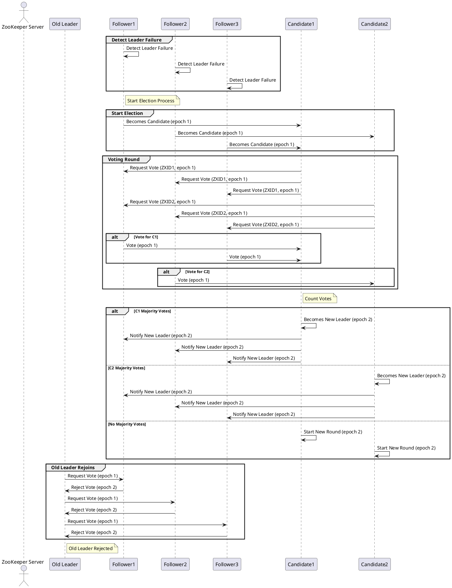
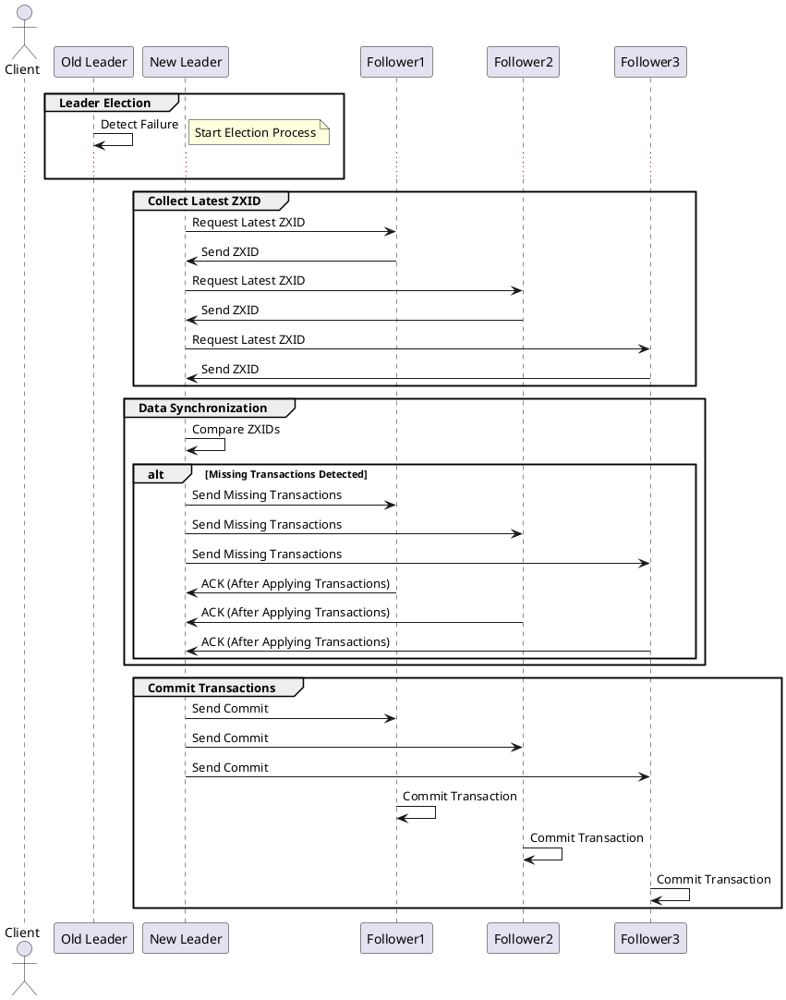
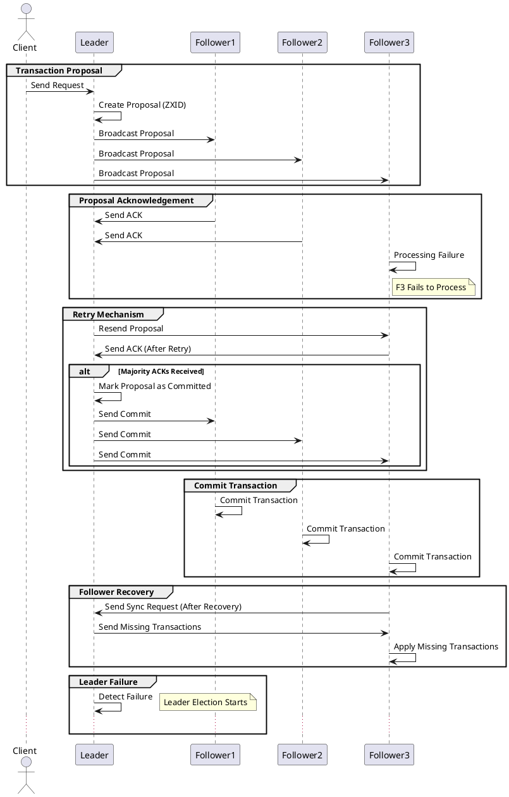

### ZAB协议简介

Zookeeper中的ZAB（ZooKeeper Atomic Broadcast）协议是一个核心的一致性协议，它确保了分布式系统中数据的一致性和可靠性。ZAB协议的开发设计人员在协议设计之初并没有要求其具有很好的扩展性，最初只是为雅虎公司内部那些高吞吐量、低延迟、健壮、简单的分布式系统场景设计的。协议虽然具备分布式一致性协议的特性，但它并不完全符合经典的二阶段提交（2PC）或三阶段提交（3PC）协议。它实际上是为Zookeeper服务专门设计的一种混合协议，具备自己独特的机制来保证一致性和高可用性。

### ZAB协议的两种模式

1. **领导选举模式**：
   当ZooKeeper集群启动时，或者当前的Leader节点崩溃时，集群将进入领导选举模式。在这个阶段，所有节点都会尝试成为新的Leader。通过一系列选举过程，最终会选出一个新的Leader和若干Follower节点。
2. **原子广播模式**：
   一旦新的Leader被选出，集群将进入原子广播模式。在这种模式下，Leader节点负责接收客户端的事务请求，并将这些请求转化为事务提议。然后，Leader节点将这些提议广播给所有Follower节点，Follower节点按照接收到的顺序应用这些提议，确保集群中的所有节点都能保持状态的一致性。

### 领导选举模式

1. **Leader失效检测**：
   * Follower节点通过心跳机制检测到Leader节点失效。
   * 一旦检测到Leader失效，Follower节点进入Leader选举状态。
2. **Candidate状态转换**：
   * 检测到Leader失效的Follower节点会将自己转换为Candidate节点，准备参与选举。
3. **投票轮次**：
   * 每个Candidate节点会增加自己的epoch（选举轮次），然后开始新的一轮投票。
4. **投票请求**：
   * Candidate节点向集群中的所有其他节点发送投票请求（包括自己的ZXID和epoch）。
   * 投票请求包含的信息有：Candidate节点的ID、当前ZXID、当前epoch等。
   * 每个Candidate只能在每一轮投票中投出一次票
5. **投票决策**：
   * 接收到投票请求的节点会根据以下规则决定是否投票给请求的Candidate：
     * 如果接收方的ZXID更大，则拒绝投票。
     * 如果接收方的ZXID相同但epoch更大，则拒绝投票。
     * 否则，将投票给请求的Candidate，并更新自己的投票记录。
6. **投票统计**：
   * Candidate节点统计收到的投票。
   * 如果一个Candidate节点获得了大多数（即超过半数）节点的投票支持，则它成为新的Leader。
   * 如果没有Candidate节点获得多数投票，所有Candidate节点进入下一轮选举，继续发送投票请求，直到选出新的Leader。
7. **宣布新Leader**：
   * 获得多数投票的Candidate节点宣布自己为新的Leader，并通知所有Follower节点。

### 数据同步

### 1. Leader选举过程

当当前Leader失效时，Zookeeper集群会启动Leader选举过程。在这个过程中，集群中的每个节点会参与选举，并根据选举算法选出新的Leader。选举过程中，每个节点会将自己认为最新的事务ID（ZXID）发送给其他节点，最终选出拥有最新ZXID的节点作为新的Leader。

### 2. 确定最新数据

新Leader被选出后，需要确保它拥有最新的数据。这是通过以下步骤实现的：

1. **收集最新ZXID**：
   * 在Leader选举过程中，每个节点会向其他节点发送其最新的ZXID。
   * 新的Leader会根据这些ZXID来确定哪个节点拥有最新的数据。
2. **Follower与Leader对齐**：
   * 新的Leader被选出后，它会收集所有Follower的最新ZXID。
   * 新的Leader会将自己的最新ZXID与每个Follower的ZXID进行比较，确定哪些事务需要同步。

### 3. 数据同步过程

一旦新的Leader确定了最新的ZXID，它会执行以下步骤来确保所有Follower节点的数据与自己对齐：

1. **发送同步请求**：
   * 新的Leader向所有Follower发送同步请求，要求它们将自己的ZXID发送回来。
   * Follower响应Leader的同步请求，发送其最新的ZXID。
2. **比较和确定缺失事务**：
   * Leader根据Follower的ZXID与自己的ZXID进行比较，确定哪些事务在Follower上是缺失的。
   * Leader会将这些缺失的事务从自己的事务日志中提取出来，准备发送给Follower。
3. **发送缺失事务**：
   * Leader将所有缺失的事务按顺序发送给Follower。
   * Follower接收到缺失的事务后，将这些事务应用到自己的事务日志中，并更新其状态。
4. **确认同步完成**：
   * 当Follower接收到并应用所有缺失事务后，向Leader发送确认消息。
   * 一旦Leader收到多数Follower的确认消息，它会将这些事务标记为已提交，并通知所有Follower提交这些事务。

### 原子广播

* **事务提案创建和广播**：
  * Client发送请求给Leader。
  * Leader创建带有ZXID的事务提案，并将提案广播给所有Follower节点。
* **提案确认（ACK）**：
  * Follower节点处理提案并发送ACK给Leader。
  * 如果Follower处理失败，它不会发送ACK。
* **重试机制**：
  * Leader会重新发送未收到ACK的提案给失败的Follower节点。
  * Follower节点在重试后成功处理提案并发送ACK。
* **提交事务**：
  * Leader收到多数Follower的ACK后，标记提案为已提交，并发送提交通知给所有Follower节点。
  * Follower节点接收到提交通知后，提交并应用事务。
* **Follower恢复和同步**：
  * 失败的Follower节点恢复后，向Leader发送同步请求。
  * Leader将缺失的事务发送给恢复的Follower，Follower应用这些事务以确保数据一致性。
* **Leader失效和选举**：
  * 如果Leader失效，Follower节点会启动Leader选举过程。
  * 新的Leader当选后，继续处理客户端请求并保证数据一致性。

### ZAB协议的特点

- **崩溃恢复**：ZAB协议支持崩溃恢复，确保即使在Leader节点失败的情况下，系统也能继续运行。
- **数据一致性**：通过确保所有节点以相同的顺序应用提议，ZAB协议保证了数据的一致性。
- **顺序保证**：ZAB协议确保了事务的全局顺序性，这对于分布式系统的同步至关重要。

### ZAB协议与其他协议的比较

ZAB协议借鉴了Paxos算法的思想，但是它更专注于实际的工程实现，并简化了Paxos算法中的一些复杂性。ZAB协议特别为Zookeeper设计，以满足其特定的需求，如快速的Leader选举和高效的数据同步。
